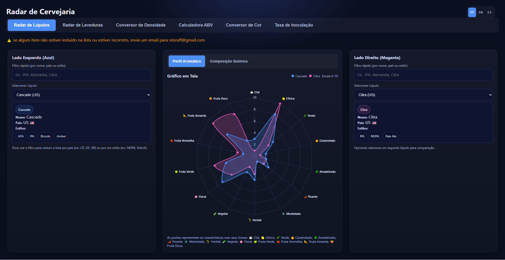
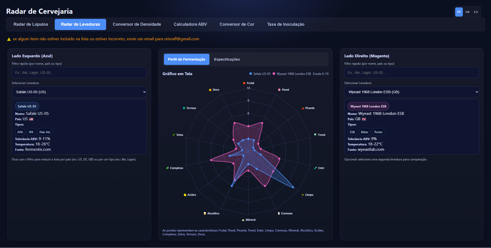
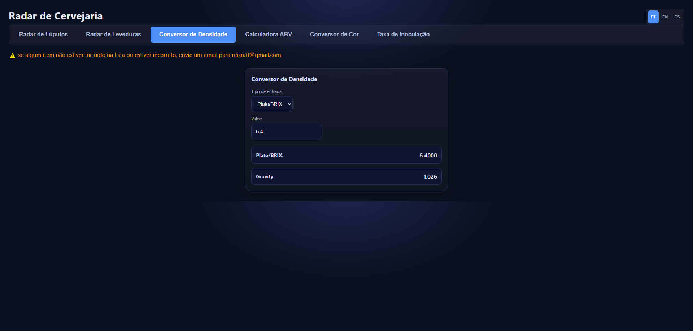
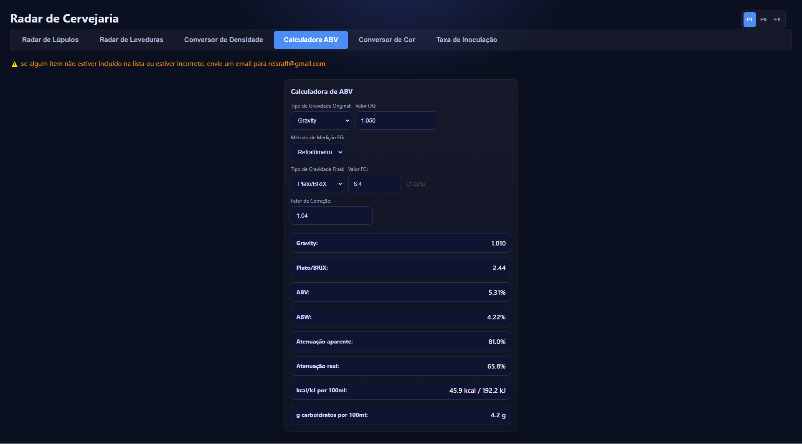
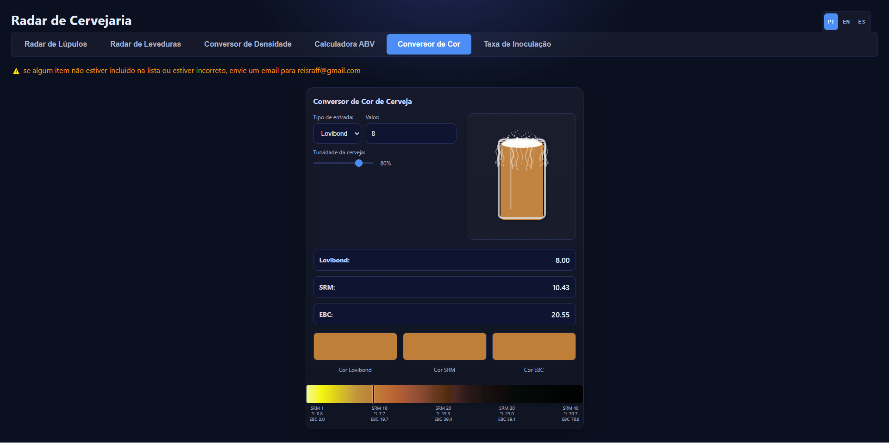
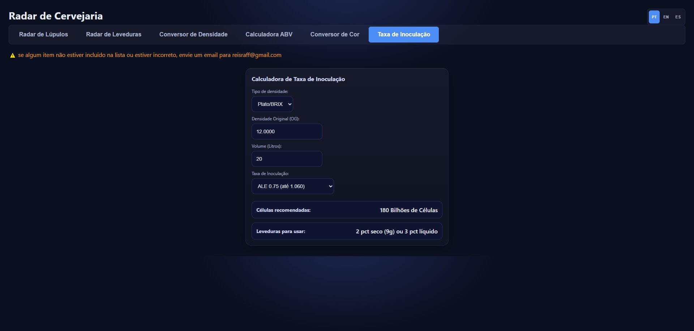

# 🍺 Brewery Radar  

**Brewery Radar** is an interactive web application designed for brewers and beer enthusiasts to visualize, compare, and calculate brewing parameters. It provides powerful tools for exploring hop and yeast profiles, density conversions, ABV calculations, beer color conversions, and pitching rate estimations—all in one modern and responsive interface.  

---

## ✨ Features  

### 🌿 Hop Radar  
- Compare **two hops side by side** (blue vs. magenta).  
- Radar chart for **aroma characteristics** (Tea, Citrus, Herbal, Floral, Fruity, etc.).  
- Chemical composition charts for:  
  - Alpha acids  
  - Beta acids  
  - Total essential oils  
- Aromatic compounds comparison (Myrcene, Humulene, Caryophyllene, Farnesene, Linalool, Geraniol, Polyphenols).  
- Quick filter by **name, country, or style**.

  

### 🍞 Yeast Radar  
- Compare **two yeast strains** simultaneously.  
- Fermentation profile radar chart (Fruity, Floral, Spicy, Phenolic, Ester, Clean, Complex, etc.).  
- Specification chart for **ABV tolerance and temperature range**.  
- Quick filter by **name, country, or type**.

  

### ⚖️ Density Converter  
- Convert between **Plato/Brix** and **Specific Gravity (SG)** instantly.

  

### 🍷 ABV Calculator  
- Supports **hydrometer** and **refractometer** methods.  
- Calculates:  
  - ABV (Alcohol by Volume)  
  - ABW (Alcohol by Weight)  
  - Apparent attenuation  
  - Real attenuation  
  - Calories per 100ml  
  - Carbohydrates per 100ml  
- Correction factor input supported.

  

### 🎨 Beer Color Converter  
- Convert between **Lovibond**, **SRM**, and **EBC** color scales.  
- Adjustable **beer transparency (turbidity)**.  
- Visual **beer glass rendering** with realistic foam and color tones.  
- Color ruler for quick reference.

  

### 🧪 Pitch Rate Calculator  
- Calculate recommended **yeast cells** and **packs** required.  
- Input parameters:  
  - Density type (Plato / Gravity)  
  - Original Gravity (OG)  
  - Volume (liters)  
  - Pitching rate (Ale or Lager, standard or high).

  

---

## 🛠️ Technologies  

- **HTML5 / CSS3 / JavaScript**  
- **Chart.js** for visualizations  
- **Responsive design** (mobile, tablet, desktop)  
- **Multilingual support**: Portuguese (PT), English (EN), Spanish (ES)  
- Custom brewing calculators and converters  

---

## 🚀 Getting Started  

### Clone the repository  
```bash
git clone https://github.com/your-username/brewery-radar.git
cd brewery-radar
```

### Run locally  
Simply open `index.html` in your browser. No build step required.  

### Deploy  
You can host it on:  
- GitHub Pages  
- Netlify  
- Vercel  
- Any static web server  

---

## 🌍 Internationalization  

- Switch between **PT / EN / ES** via the top-right language selector.  
- Easily extend translations by editing the `TRANSLATIONS` object inside the script.  

---

## 📧 Feedback  

⚠️ If any item is missing from the hop or yeast lists, or if you notice incorrect data, please send an email to **reisraff@gmail.com**.  

---

## 📜 License  

MIT License. Free to use and modify.  
